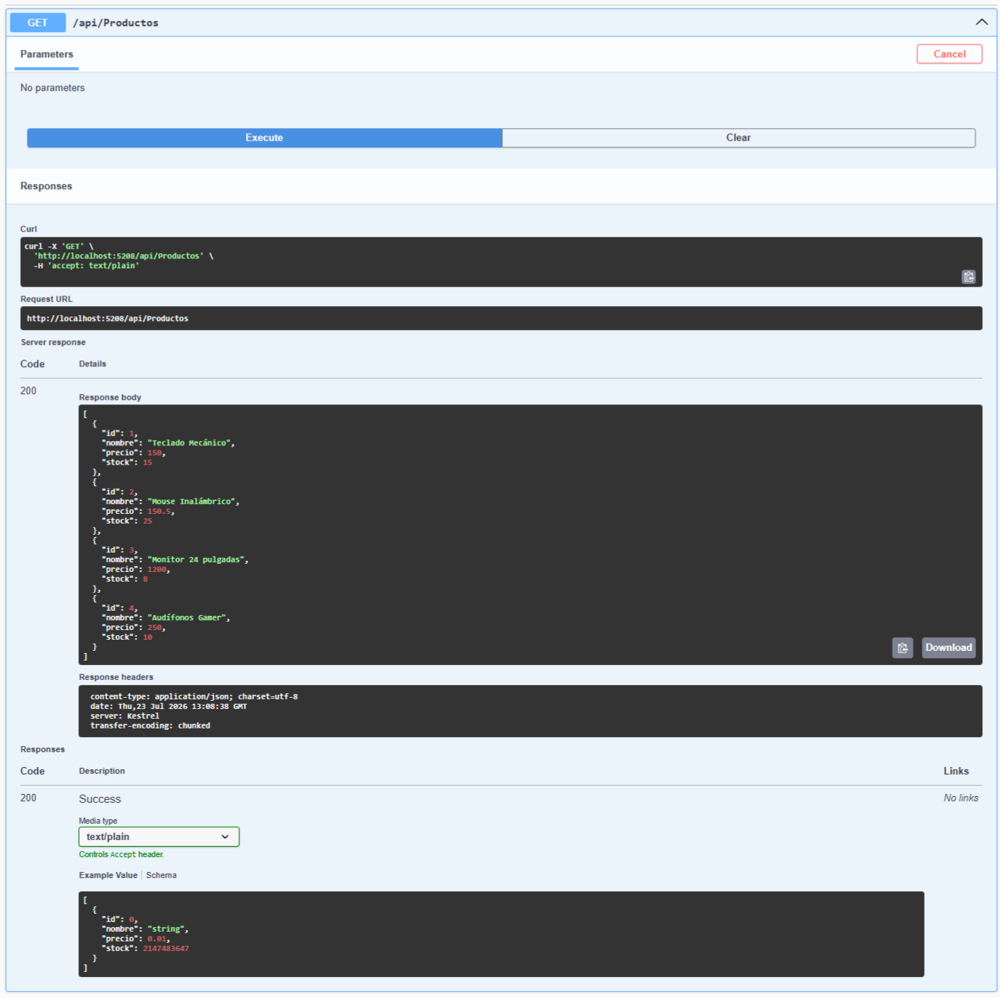
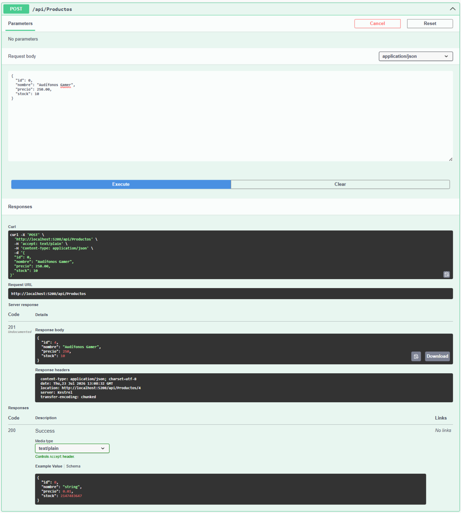
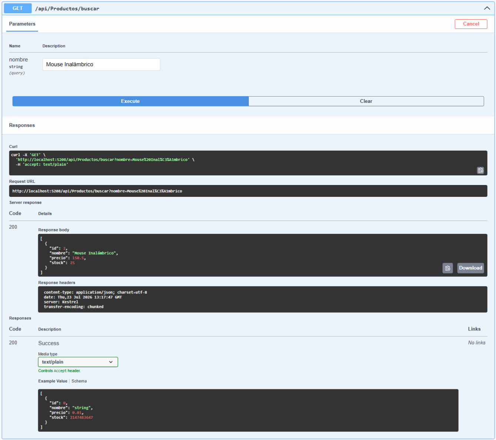
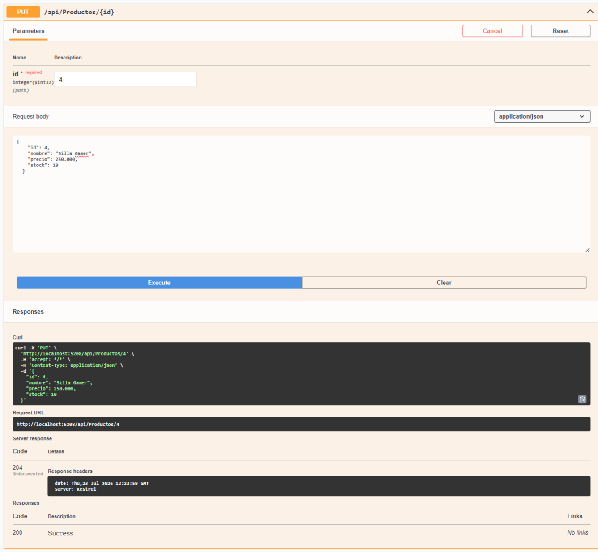
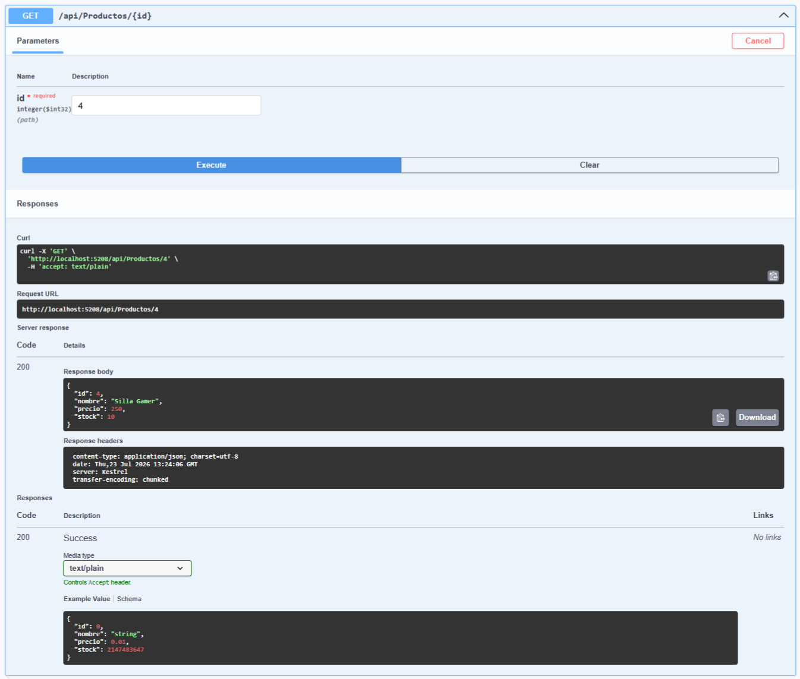
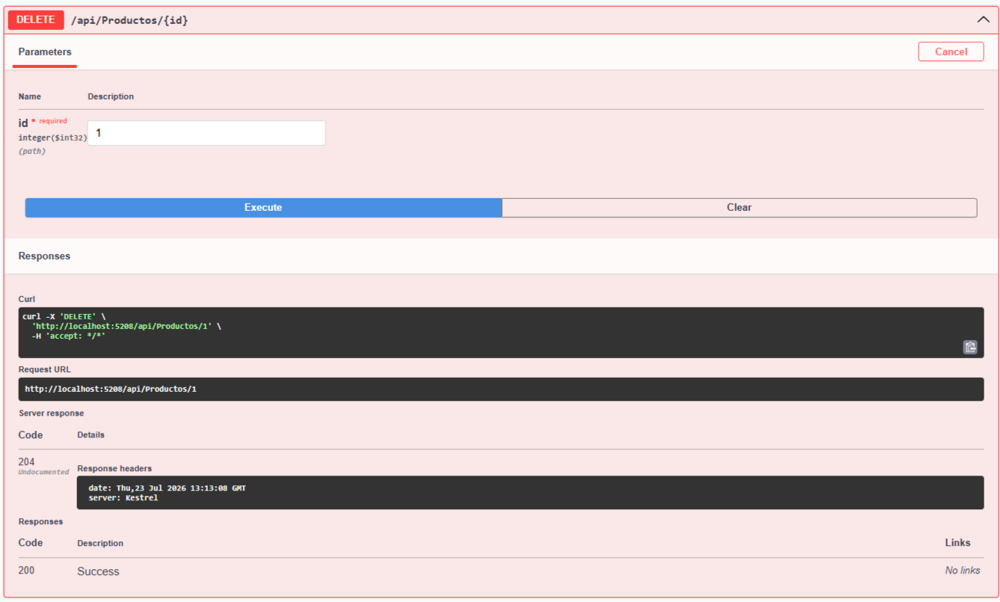
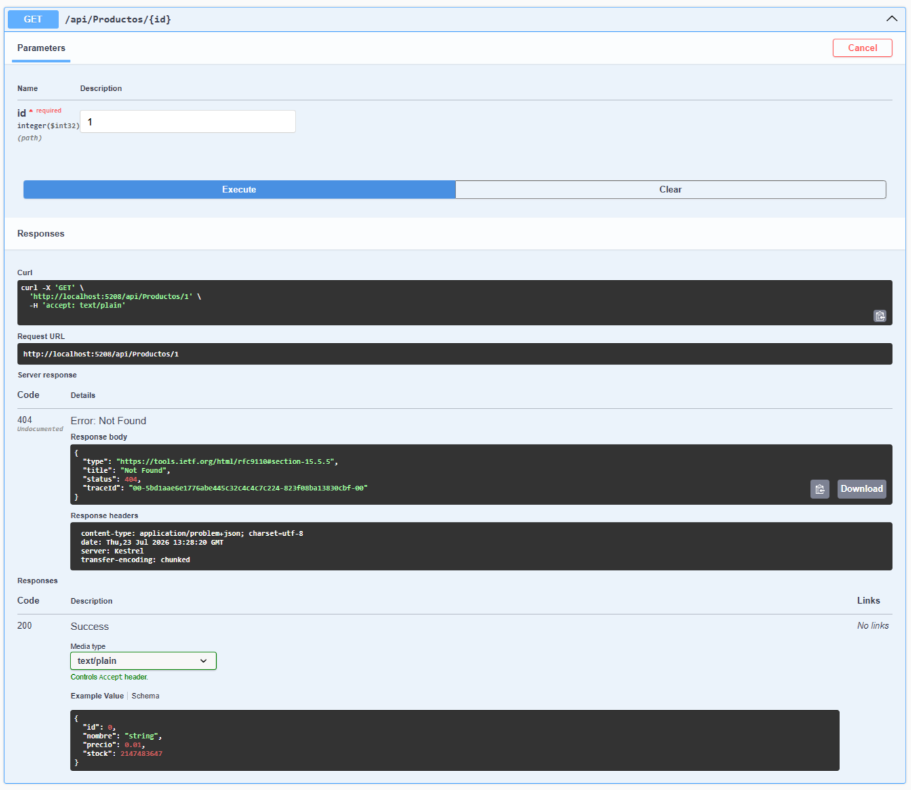
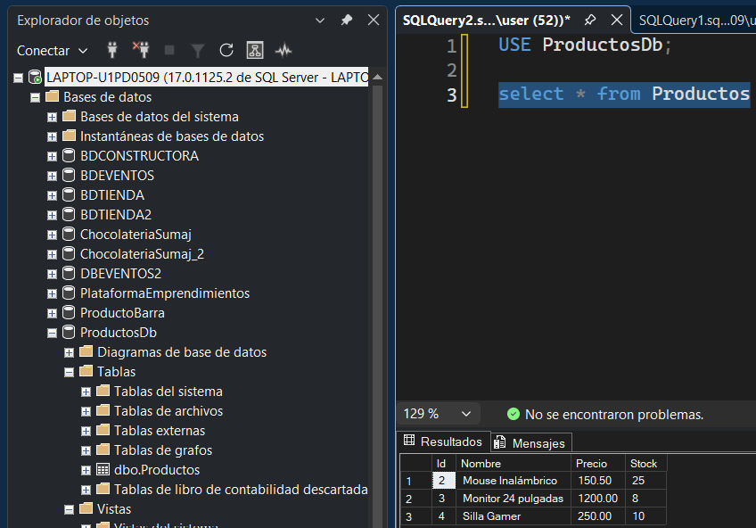

# 🛒 kiataque-marco-parcial2

Este repositorio contiene la **API RESTful** para la gestión de productos, desarrollada en **.NET Web API** con **Entity Framework Core** y conectada a **SQL Server** como parte del Examen Parcial 2.

---

## 📑 Tabla de Contenidos

1. [Descripción del Proyecto](#-descripción-del-proyecto)
2. [Pruebas de Funcionamiento API Backend (CRUD Productos)](#-pruebas-de-funcionamiento-api-backend-crud-productos)
3. [Arquitectura y Estructura del Backend](#️-arquitectura-y-estructura-del-backend)
4. [Base de Datos](#-base-de-datos)
5. [Guía de Instalación y Ejecución](#-guía-de-instalación-y-ejecución)

---

## 📝 Descripción del Proyecto

El proyecto consiste en un servicio Web API orientado al mantenimiento y consulta del catálogo de productos. Permite realizar operaciones clave de administración (creación, lectura, actualización y eliminación de productos), así como búsquedas por nombre, interactuando directamente con una base de datos relacional en SQL Server (`ProductosDb`).

**Ficha Técnica:**
* **Desarrollador:** Marco Antonio Kiataque Uchima
* **Repositorio:** [MarcoKiataque27/kiataque-marco-parcial2](https://github.com/MarcoKiataque27/kiataque-marco-parcial2)
* **Tecnologías:** .NET 8 / C#, Entity Framework Core, SQL Server
* **Documentación de API:** Swagger UI

---

## 🧪 Pruebas de Funcionamiento API Backend (CRUD Productos)

El backend expone operaciones RESTful probadas y documentadas mediante **Swagger UI**. A continuación, se detallan las evidencias del ciclo de vida completo (CRUD) para la entidad `Productos`:

### 📸 Evidencias de Operaciones HTTP

<table>
  <tr>
    <td align="center" width="50%"><b>01. GET — Listar Todos los Productos</b></td>
    <td align="center" width="50%"><b>02. POST — Registrar Nuevo Producto</b></td>
  </tr>
  <tr>
    <td></td>
    <td></td>
  </tr>
  <tr>
    <td>Consulta general <code>200 OK</code> retornando el catálogo completo en formato JSON.</td>
    <td>Registro exitoso <code>201 Created</code> agregando un nuevo producto ("Audífonos Gamer").</td>
  </tr>
  <tr>
    <td align="center" width="50%"><b>03. GET por ID — Consultar Registro Específico</b></td>
    <td align="center" width="50%"><b>04. GET por Nombre — Búsqueda de Productos</b></td>
  </tr>
  <tr>
    <td></td>
    <td></td>
  </tr>
  <tr>
    <td>Búsqueda directa <code>200 OK</code> filtrando por ID (ej. ID 1).</td>
    <td>Búsqueda <code>200 OK</code> mediante parámetro query (ej. "Mouse Inalámbrico").</td>
  </tr>
  <tr>
    <td align="center" width="50%"><b>05. PUT — Actualizar Datos de Producto</b></td>
    <td align="center" width="50%"><b>06. GET por ID — Verificar Modificación</b></td>
  </tr>
  <tr>
    <td></td>
    <td></td>
  </tr>
  <tr>
    <td>Modificación exitosa <code>204 No Content</code> cambiando datos del registro ID 4 ("Silla Gamer").</td>
    <td>Verificación <code>200 OK</code> del recurso actualizado correctamente.</td>
  </tr>
  <tr>
    <td align="center" width="50%"><b>07. DELETE — Eliminar Registro</b></td>
    <td align="center" width="50%"><b>08. GET por ID — Validar Error 404 (Not Found)</b></td>
  </tr>
  <tr>
    <td></td>
    <td></td>
  </tr>
  <tr>
    <td>Eliminación exitosa <code>204 No Content</code> del registro con ID 1.</td>
    <td>Respuesta controlada <code>404 Not Found</code> confirmando que el ID 1 ya no existe.</td>
  </tr>
    <tr>
    <td align="center" width="50%"><b>07. DELETE — Eliminar Registro</b></td>
    <td align="center" width="50%"><b>08. GET por ID — Validar Error 404 (Not Found)</b></td>
  </tr>
  <tr>
    <td></td>
    <td></td>
  </tr>
  <tr>
    <td>Base de datos</code> tabla de los productos eliminados y creados .</td>
  </tr>
</table>

---

## ⚙️ Arquitectura y Estructura del Backend

El backend se encuentra estructurado bajo patrones limpios de arquitectura web en .NET:

```bash
kiataque-marco-parcial2/
├── Context/                # Configuración de DbContext y Entity Framework
├── Controllers/            # Controladores API (ProductosController.cs)
├── Models/                 # Modelos de Entidad (Producto.cs)
├── docs/
│   └── img/                # Capturas de evidencias de Swagger
├── Program.cs              # Configuración de servicios y middleware
└── appsettings.json        # Cadena de conexión a base de datos
```
-Controladores (Controllers/):

  - ProductosController.cs: Expone las rutas RESTful (GET, POST, PUT, DELETE, GET /buscar).

-Modelos (Models/):

  - Producto.cs: Definición del modelo de entidad (campos Id, Nombre, Precio, Stock).

- Contexto de Datos (Context/):

  - Configuración de Entity Framework Core para la ORM.

🗄️ Base de Datos
El sistema interactúa con una base de datos SQL Server llamada ProductosDb.

```bash
CREATE DATABASE ProductosDb;

USE ProductosDb;

CREATE TABLE Productos (
    Id INT IDENTITY(1,1) PRIMARY KEY,
    Nombre NVARCHAR(100) NOT NULL,
    Precio DECIMAL(18,2) NOT NULL,
    Stock INT NOT NULL
);
```

🚀 Guía de Instalación y Ejecución
Sigue estos pasos para correr la API localmente:

1. Clonar el repositorio
```bash
git clone [https://github.com/MarcoKiataqueUz/kiataque-marco-parcial2.git](https://github.com/MarcoKiataqueUz/kiataque-marco-parcial2.git)
cd kiataque-marco-parcial2
```
2. Configurar Cadena de Conexión
Verifica que en el archivo appsettings.json la cadena apunte a tu servidor de SQL Server:

```bash
{
  "ConnectionStrings": {
    "DefaultConnection": "Server=TU_SERVIDOR;Database=ProductosDb;Trusted_Connection=True;TrustServerCertificate=True;"
  }
}
```
3. Compilar y ejecutar la API
```bash
dotnet restore
dotnet build
dotnet run
```
4. Acceder a Swagger
Una vez iniciado el servidor, abre tu navegador web e ingresa a:
```bash
http://localhost:5208/swagger
```
